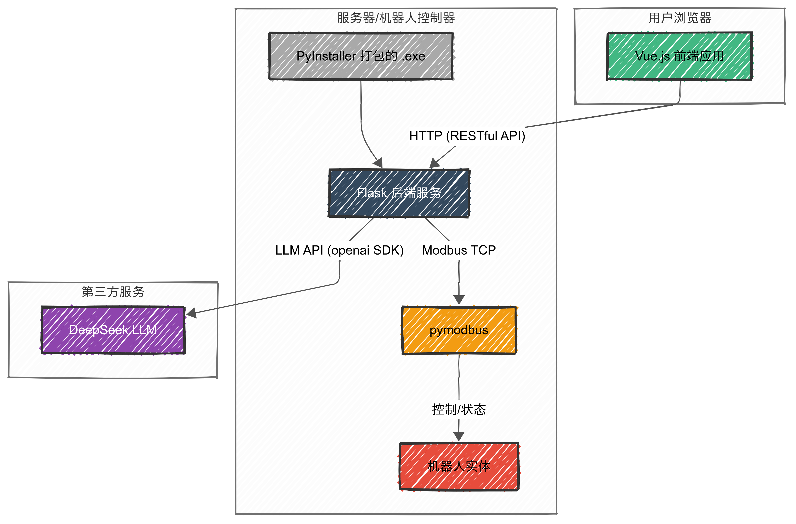
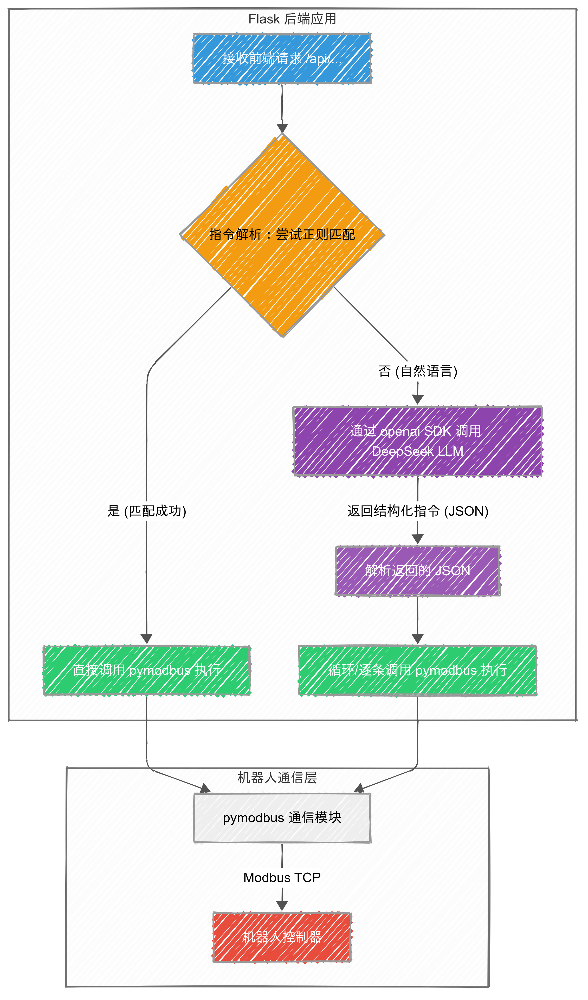
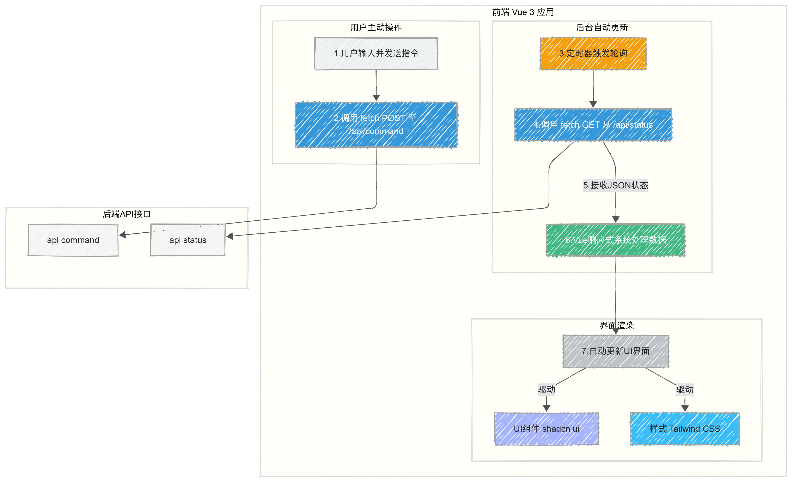
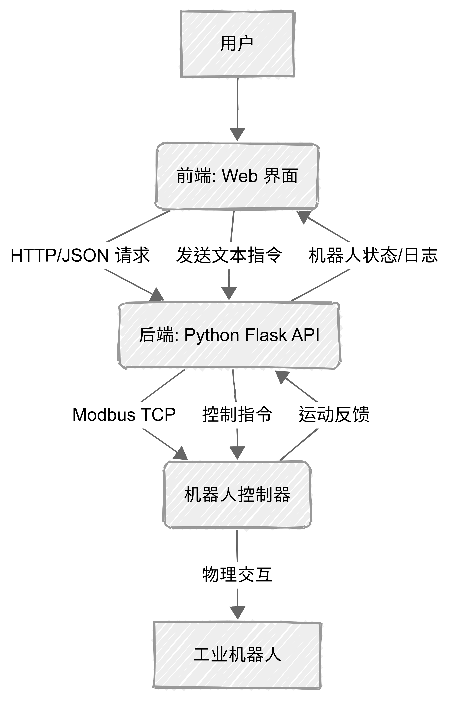
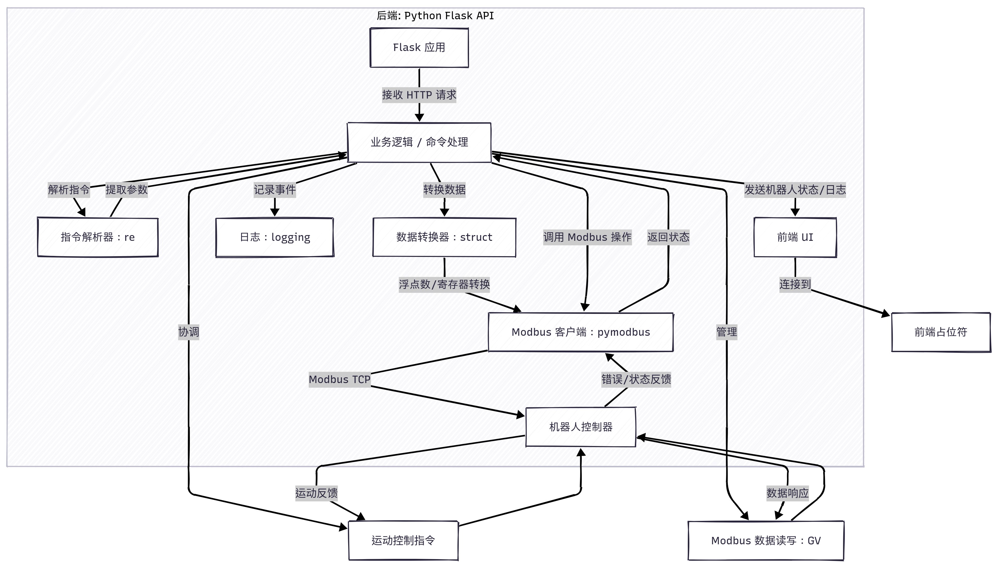
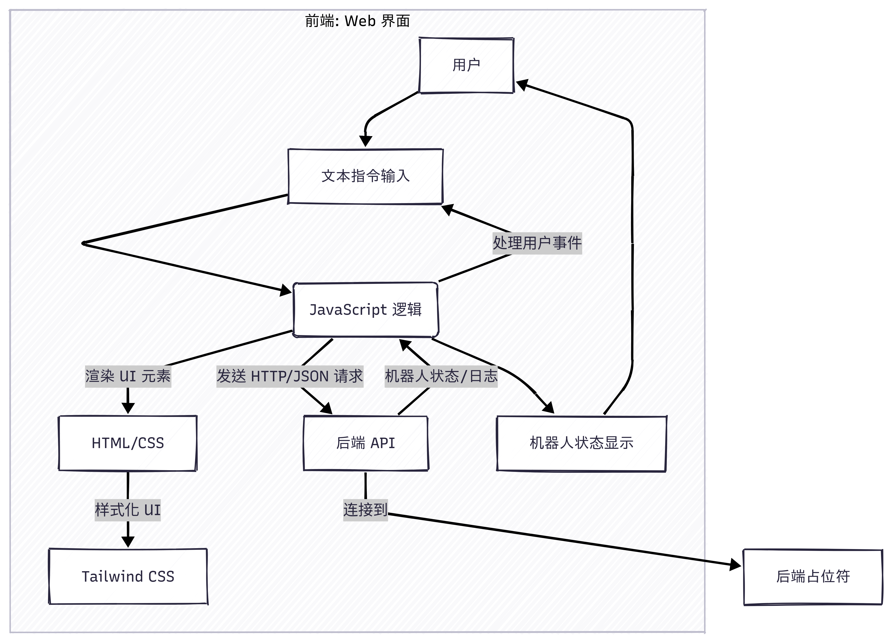

# text-based-robot-trajectory-control
# 基于文本的工业机器人轨迹运动控制

[简体中文](#cn)
---
<span id="cn">

</span>

Text-based Robot Trajectory Control 是一个在生产实习中开发的工业机器人二次开发项目，旨在通过简单、直观的文本指令来控制工业机器人（当前主要适配培高/博创系统）。项目的核心创新在于将传统的严格格式指令与由大语言模型（LLM）驱动的自然语言理解相结合，让用户无论是需要精确控制还是希望便捷操作，都能找到最高效的方式。

项目利用 Modbus TCP 协议与机器人进行通信，并通过一个 Web 界面提供直观的用户交互。

## 功能特点 (Features)
### 双模指令系统 (Dual-Mode Command System):

1. 自然语言控制: 由 DeepSeek LLM 强力驱动，可直接理解并执行如“让关节1转动30度，然后把速度设为50”等复杂的日常语言指令。

2. 严格格式优先: 系统会优先解析精确的文本指令，确保了自动化脚本的执行效率和确定性，失败后则无缝回退至自然语言解析。

### 全新现代化UI (All-new Modern UI):

1. 前端界面使用 Vue 3, Vite, 和 TypeScript 完全重构。

2. 所有组件均由 shadcn/ui 和 Tailwind CSS 构建，提供了专业、美观、响应迅速的操作体验。

### 个性化与易用性 (Customization & Usability):

1. 主题切换: 内置明亮/暗黑模式一键切换功能。

2. 一键启动: 打包后的程序在启动时会自动打开用户的默认浏览器并加载控制界面。

3. 指令参考: UI内嵌了可折叠的“严格指令参考”组件，方便随时查阅。

### 后端集成与部署简易 (Robust Backend & Deployment):

1. 已使用 PyInstaller 将整个应用打包为独立的可执行文件，用户无需安装 Python 或任何依赖即可运行。

2. 通过外部 config.json 文件管理所有关键配置，实现了程序与配置的完全分离。

## 技术栈演进 (Tech Stack Evolution)

为后续引入更高级的功能并优化项目整体架构，在计划 v2.0.0 版本时，我们对技术栈进行了一次迭代升级。此次升级并非简单的修补，而是基于未来扩展性和现存技术瓶颈的考量，进行的一次系统性重构。

- [当前技术栈](#技术栈与项目原理-tech-stack--principles)
- [旧版技术栈](#旧版技术栈-legacy-stack)

## 技术栈与项目原理 (Tech Stack & Principles)
> 这是项目目前正在使用的技术栈，具备更高的性能、更好的开发体验和更完善的社区支持。

本项目的核心是前后端分离的架构，通过 `RESTful API` 进行通信，并集成第三方 LLM 服务实现自然语言理解。

### 后端 (Backend)
后端是一个基于 Python 和 Flask 的应用，它承担了所有的核心逻辑，包括设备通信、指令解析和 Web 服务。

- Web框架： Flask 用于构建轻量级的Web服务。在本项目中，它承担双重职责：

    1. 提供 /api/... 接口，处理前端发送的指令和状态请求。

    2. 托管由前端构建生成的静态文件（HTML/CSS/JS），使用户通过一个服务即可访问整个应用。

- 机器人通信： `pymodbus` 库是与机器人沟通的桥梁，负责通过 `Modbus TCP` 协议向机器人控制器读写寄存器，从而执行运动指令和获取状态。

- 自然语言处理： `openai Python SDK` 用于与 `DeepSeek LLM` 的 API 进行交互。当后端收到无法按严格格式解析的指令时，会调用此库将自然语言文本发送给 LLM 。

- 打包工具： `PyInstaller` 用于将整个 Python 应用（包括 Flask 服务和所有依赖 ）打包成一个独立的可执行文件（ .exe ），实现了免安装部署。

### 前端 (Frontend)
前端是一个现代化的单页应用（ SPA ），旨在提供一个美观、流畅且功能丰富的用户交互界面。

- 核心框架: `Vue 3` （使用 `<script setup>` 组合式 API ） 是构建整个用户界面的核心。它负责管理应用的状态（如日志、机器人状态）、处理用户交互，并以组件化的方式构建UI。

- 构建工具: `Vite` 提供了闪电般快速的开发服务器和高效的打包优化能力，是现代前端开发的标准工具链。

- 语言: `TypeScript` 为项目提供了强大的类型支持，增加了代码的健壮性和可维护性。

- UI与样式:

    - `Tailwind CSS` 用于原子化、功能优先的CSS样式开发，能够快速构建出灵活且一致的界面。

    - `shadcn/ui` 作为一个可复用的UI组件集合，为项目提供了诸如按钮、卡片、折叠面板等高质量、可定制的预制组件。
    



### 🔗 技术关系与工作原理
1. 用户交互流程：

- 用户在 `Vue前端` 界面的输入框中输入指令。

- 点击“发送”后，前端通过 `fetch API` 向 `Flask后端` 的 `/api/command` 接口发送一个 POST 请求。

2. 后端指令解析原理（双模系统）：

- `Flask` 收到请求后，首先会尝试使用 `正则表达式 (re)` 对指令进行严格格式匹配。

- 如果匹配成功，后端会直接调用相应的 `pymodbus` 函数执行该指令，此路径效率最高、最可靠。

- 如果匹配失败，后端则认为这是自然语言指令。它会通过 `openai` 库将这段文本发送给 `DeepSeek LLM`。

- LLM 根据预设的 `Prompt` ，将自然语言解析成一个`结构化的指令序列（JSON格式）`返回给后端。

- 后端解析这个`JSON`，然后按顺序逐一调用 `pymodbus` 函数执行每个动作。

3. 状态更新流程：

- `Vue前端` 会定期（或在操作后）向后端的 `/api/status` 接口发送GET请求。

- `Flask后端` 收到请求后，通过 `pymodbus` 从机器人读取最新的运行状态、模式、报警等信息。

- 后端将这些信息以`JSON`格式返回给前端。

- 前端接收到新的状态数据后，Vue的响应式系统会自动更新UI界面，用户即可看到最新的机器人状态。

## 如何运行 (How to Run)
> 这是项目目前的使用说明，本项目自v2.0.0版本起，用了全新的技术栈重构项目，具备更高的性能、更好的开发体验和更完善的社区支持。
> 
> [如有需要，点击查看v1.0.0版本（旧版）使用说明](#旧版使用说明-legacy-usage)

我们为两种不同类型的用户提供了清晰的指南：希望直接使用的普通用户，以及进阶使用的开发者。

### 方式一：直接运行可执行程序 (推荐)
这种方式最为简单，无需安装Python或任何依赖环境，适合绝大多数用户。

1.  **下载releases文件**:

    请访问本项目的 Releases页面。在该页面下载最新版本打包好的 .zip 压缩文件。解压后，您会看到一个可执行文件（如 `Text.based.Robot.Control.Ver.1.0.0.250624-release.exe`）一个 `config.json` 配置文件和一个 `README.txt`使用说明文本文件。

2.  **阅读`README.txt`文件**:

    打开`README.txt`文件，该文件包含了使用说明、配置说明以及注意事项等内容。
    
    仔细阅读后能极大程度帮助你理解如何配置和使用本项目提供的可执行程序（`.exe`）

3.  **配置文件设置**:

    打开 `config.json`，配置`robot`、`motion`、`server`和`llm_config`和部分内容。

    一般来说，`robot`部分内容是本程序正常运行的基础，该部分决定了本程序能否与机器人正常建立 Modbus 协议通讯。

    根据你的机器人网络设置修改 `robot` 部分的变量即可正常使用。
    ```json
    {
     "robot": {
        "_comment_robot": "这里是机器人的相关配置，请根据实际情况修改IP地址",
        "ip": "192.168.0.11",
        "port": 502,
        "slave_id": 1
          },
          ...
    ```
    剩下三部分请根据需要自行设置。
    
    若要使用自然语言处理功能，请正确配置`llm_config`部分内容，请输入 LLM 大语言模型（如Open AI, DeepSeep等）的api，详情请查阅对应 LLM 大语言模型的 API 开发文档。

4.  **运行程序**:

    保存 `config.json` 文件后，直接双击运行可执行文件。程序启动后，会自动打开默认浏览器访问 `http://127.0.0.1:5000` 打开控制界面。接下来您就可以正常使用了！

### 方式二：从源代码运行 (适合开发者)
如果您希望查看或修改源代码，可以采用此方式。

    环境要求:
    - Python 3.8+
    - Node.js 18+
    - Git


1.  **克隆仓库**:
    ```bash
    git clone https://github.com/xicheng2003/text-based-robot-trajectory-control
    cd text-based-robot-trajectory-control
    ```
2.  **后端设置**:
    ```bash
    # 进入后端目录
    cd backend

    # (推荐) 创建并激活一个虚拟环境
    python -m venv venv
    # Windows:
    # venv\Scripts\activate
    # macOS/Linux:
    # source venv/bin/activate

    # 安装依赖
    pip install -r requirements.txt 
    ```

3.  **前端设置**:
    ```bash
    # (在另一个终端中) 进入前端目录
    cd frontend
    # 安装依赖
    npm install
    ```
4.  **配置文件设置**:
    打开 `backend` 目录下的 `config.json` 并根据您的实际情况填写 `robot.ip` 和 `llm_config.api_key` 等字段。

5.  **构建前端静态内容**:
    在 `frontend` 目录的终端中运行
    ```bash
    npm run build
    ```
    
5.  **启动后端服务**:
    在 `backend` 目录的终端中运行:
    ```python
    python app.py
    ```
    运行后等待默认浏览器自动打开 `http://127.0.0.1:5000` 控制页面即可。服务将在 `http://0.0.0.0:5000` 上运行。

## 使用说明 (Usage)

在Web界面中，你可以在“输入指令 (多行)”文本框中输入多行指令，然后点击“发送指令”按钮。
指令支持**自然语言控制**和**严格格式指令**控制。
- 自然语言控制: 在默认的配置文件中，已经接入DeepSeek API，可根据实际需要改成自己的。

    由 DeepSeek LLM 强力驱动，可直接理解并执行如“让关节1转动30度，然后把速度设为50”等复杂的日常语言指令。

- 严格格式优先: 系统会优先解析精确的文本指令，确保了自动化脚本的执行效率和确定性，失败后则无缝回退至自然语言解析。

**支持的严格格式指令示例**:

-   `AUTO_MODE` 或 `自动模式`: 切换机器人到自动模式。
-   `SET_SPEED <速度值>` 或 `设置速度 <速度值>`: 设置机器人运动速度（例如：`SET_SPEED 50`）。如果未指定速度值，将使用默认值 100。
-   `MOVE J<1-6> <角度>` 或 `移动 J<1-6> <角度>`: 控制指定关节轴进行增量运动（例如：`MOVE J1 30`）。
-   `MOVE X/Y/Z/A/B/C <距离/角度>` 或 `移动 X/Y/Z/A/B/C <距离/角度>`: 控制指定基坐标系轴进行增量运动（例如：`MOVE X 100`）。
-   `GO_HOME_J<1-6>` 或 `回零 J<1-6>`: 控制指定关节轴回零（例如：`GO_HOME_J1`）。
-   `GO_HOME_ALL` 或 `全轴回零`: 控制所有关节轴回零。
-   `PAUSE_MOVE` 或 `暂停运动`: 暂停当前机器人运动。
-   `CONTINUE_MOVE` 或 `继续运动`: 继续被暂停的机器人运动。
-   `STOP_MOVE` 或 `停止运动`: 立即停止当前机器人运动。
-   `MONITOR` 或 `状态监控`: 触发前端状态轮询（通常由前端自动处理）。
-   `TEST_WRITE_GV0 <值>` 或 `测试写入GV0 <值>`: 向全局变量GV0写入一个浮点测试值（例如：`TEST_WRITE_GV0 123.45`）。

**重要提示**:

-   `MOVE` 和 `GO_HOME` 指令会触发机器人实际运动，后端会等待运动完成。
-   在执行任何运动指令前，请确保机器人处于安全环境中，并已正确配置。


### 旧版技术栈 (Legacy Stack)
> 这是项目早期的技术栈，为了记录和参考而保留。由于存在性能瓶颈和维护困难，现已弃用。

[回到当前技术栈](#技术栈与项目原理-tech-stack--principles)



## 技术栈 (Technology Stack)

-   **后端**: Python (使用 Flask 框架)
    -   **Modbus通信**: `pymodbus` 库用于实现Modbus TCP通信，负责与博创机器人进行数据读写。
    -   **Web框架**: `Flask` 用于构建轻量级的API服务，处理前端请求并与Modbus客户端交互。
    -   **跨域支持**: `Flask-CORS` 扩展用于处理前端跨域请求。
    -   **日志**: Python内置的 `logging` 模块用于记录后端操作和调试信息。
    -   **数据转换**: `struct` 模块用于处理浮点数与Modbus寄存器16位整数之间的转换，以适应博创系统的Modbus数据映射（小端模式）。
    -   **文本解析**: `re` (正则表达式) 模块用于解析和规范化用户输入的中文或英文文本指令。


-   **前端**: HTML, CSS (Tailwind CSS), JavaScript
    -   **界面**: `index.html` 构建了用户操作界面，包括指令输入、状态显示和操作按钮。
    -   **样式**: `Tailwind CSS` 用于快速构建和定制响应式、现代化的用户界面。
    -   **交互**: 原生JavaScript负责处理用户输入、发送HTTP请求到后端API、更新机器人状态显示以及日志输出。
    -   **异步通信**: `fetch API` 用于与后端进行异步数据交互，确保用户界面的流畅性。




## 旧版使用说明 (Legacy Usage)
> 这是项目早期版本v1.0.0的使用说明，为了记录和参考而保留。由于存在性能瓶颈和维护困难，现已弃用。
> 
> [回到当前版本使用说明](#如何运行-how-to-run)

您可以根据自己的需求，选择以下两种方式来运行本项目。

### 方式一：直接运行可执行程序 (推荐)
这种方式最为简单，无需安装Python或任何依赖环境，适合绝大多数用户。

1.  **下载releases文件**:

    请访问本项目的 Releases页面。在该页面下载最新版本打包好的 .zip 压缩文件。解压后，您会看到可执行文件（如 `Text.based.Robot.Control.Ver.1.0.0.250624-release.exe`）和一个 `config.json` 配置文件。

2.  **配置文件设置**:

    打开 `config.json`，配置`robot`、`motion`、`server`三部分内容。

    一般来说，根据你的机器人网络设置修改 `robot` 部分的变量即可正常使用。
    ```json
    {
     "robot": {
        "_comment_robot": "这里是机器人的相关配置，请根据实际情况修改IP地址",
        "ip": "192.168.0.11",
        "port": 502,
        "slave_id": 1
          },
          ...
    ```
3.  **运行程序**:

    保存 `config.json` 文件后，直接双击运行可执行文件。程序启动后，在浏览器中访问 `http://127.0.0.1:5000` 即可打开控制界面。

### 方式二：从源代码运行 (适合开发者)
如果您希望查看或修改源代码，可以采用此方式。


1.  **克隆仓库**:
    ```bash
    git clone https://github.com/xicheng2003/text-based-robot-trajectory-control
    cd text-based-robot-trajectory-control
    ```
2.  **安装Python依赖**:
    ```bash
    pip install Flask Flask-Cors pymodbus
    ```
3.  **配置文件设置**:
    打开 `config.json`，根据你的机器人实际IP地址修改 `ROBOT_IP` 变量。
    ```python
    ROBOT_IP = '192.168.0.11' # <-- 请根据你的机器人实际IP地址修改！
    ```
4.  **运行后端服务**:
    ```bash
    python app.py
    ```
    服务将在 `http://0.0.0.0:5000` 上运行。
5.  **打开前端界面**:
    在浏览器中直接打开 `index.html` 文件即可。

### 操作说明 (Usage)

在Web界面中，你可以在“输入指令 (多行)”文本框中输入多行指令，然后点击“发送指令”按钮。

**支持的指令示例**:

-   `AUTO_MODE` 或 `自动模式`: 切换机器人到自动模式。
-   `SET_SPEED <速度值>` 或 `设置速度 <速度值>`: 设置机器人运动速度（例如：`SET_SPEED 50`）。如果未指定速度值，将使用默认值 100。
-   `MOVE J<1-6> <角度>` 或 `移动 J<1-6> <角度>`: 控制指定关节轴进行增量运动（例如：`MOVE J1 30`）。
-   `MOVE X/Y/Z/A/B/C <距离/角度>` 或 `移动 X/Y/Z/A/B/C <距离/角度>`: 控制指定基坐标系轴进行增量运动（例如：`MOVE X 100`）。
-   `GO_HOME_J<1-6>` 或 `回零 J<1-6>`: 控制指定关节轴回零（例如：`GO_HOME_J1`）。
-   `GO_HOME_ALL` 或 `全轴回零`: 控制所有关节轴回零。
-   `PAUSE_MOVE` 或 `暂停运动`: 暂停当前机器人运动。
-   `CONTINUE_MOVE` 或 `继续运动`: 继续被暂停的机器人运动。
-   `STOP_MOVE` 或 `停止运动`: 立即停止当前机器人运动。
-   `MONITOR` 或 `状态监控`: 触发前端状态轮询（通常由前端自动处理）。
-   `TEST_WRITE_GV0 <值>` 或 `测试写入GV0 <值>`: 向全局变量GV0写入一个浮点测试值（例如：`TEST_WRITE_GV0 123.45`）。

**重要提示**:

-   `MOVE` 和 `GO_HOME` 指令会触发机器人实际运动，后端会等待运动完成。
-   在执行任何运动指令前，请确保机器人处于安全环境中，并已正确配置。

## 文件说明

-   `app.py`: Flask后端应用程序，包含Modbus通信逻辑、指令处理和API接口。
-   `index.html`: 前端用户界面文件。
-   `博创系统modbus从站运动控制功能2023.12.22-V3.0.pdf`: 博创机器人Modbus从站运动控制功能文档（版本V3.0），详细说明了Modbus地址映射、功能码和运动控制功能。
-   `控制系统编址说明v2.3_201214（scara）.pdf`: 博创机器人控制系统编址说明（版本V2.3），提供了全局变量和Modbus地址的详细信息。
-   `广东培高科技有限公司控制系统使用说明书202210_解密.pdf`: 广东培高科技有限公司的控制系统使用说明书，提供了关于Betrun控制系统的全面编程和操作指南。

## 贡献 (Contribution)

欢迎对本项目提出改进意见或贡献代码！如果你发现任何问题或有新功能建议，请提交 Issue 或 Pull Request。

在提交 Pull Request 之前，请确保您的代码遵循了项目现有的编码风格。

## 致谢 (Acknowledgements)
核心开发者：xicheng2003

团队成员：Pei Zhijie, Liu Jinhang, Lin Taimin

技术驱动：pymodbus, DeepSeek AI, Vue.js, Flask 等优秀的开源项目。

## 许可证 (License)

本项目采用 MIT 许可证。详见 `LICENSE` 文件。

---
